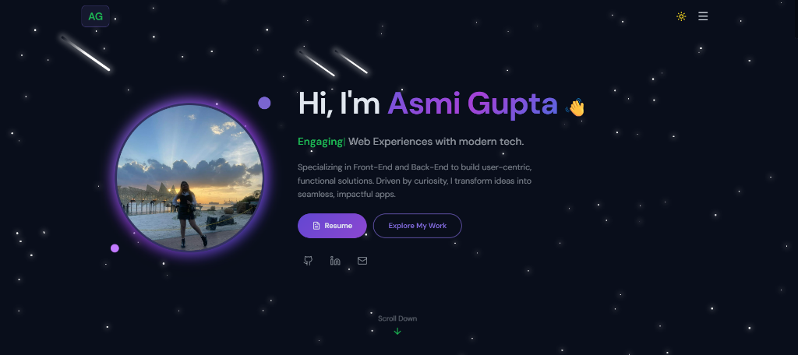

# ✨ Asmi Gupta — Portfolio

A modern, responsive personal portfolio built with **React**, **Vite**, and **Tailwind CSS v4** featuring dark/light mode, glassmorphism UI, and smooth animations.



## 🚀 Live Demo

🔗 [View Portfolio](https://asmigupta.vercel.app)

## 🛠️ Tech Stack

| Technology | Usage |
|------------|-------|
| **React** | UI Components |
| **Vite** | Build Tool & Dev Server |
| **Tailwind CSS v4** | Styling & Design System |
| **Lucide React** | Icons |
| **DM Sans + Inter** | Typography |

## 📂 Sections

- **🏠 Hero** — Typing animation, profile image with glowing ring, social links
- **🧑‍💻 About** — Education timeline, experience, and service cards
- **⚡ Skills** — 18 technologies with real brand SVG logos
- **📁 Projects** — Project cards with live screenshots, tech tags, and links
- **🏆 Certifications** — Certificates with issuer info and verification links
- **📬 Contact** — Two-column layout with connect cards + contact form
- **🌙 Dark/Light Mode** — Cosmic dark theme with stars & meteors

## 🎨 Key Features

- 🌗 **Dark mode default** with cosmic star background
- 📱 **Fully mobile responsive** — works on all screen sizes
- 🪟 **Glassmorphism** design with subtle blur and glow effects
- ✍️ **Typing animation** in hero section
- 🎯 **Smooth scroll** navigation with active section highlighting
- 🔝 **Scroll-to-top** button
- 🖼️ **Project screenshots** with hover zoom effects

## 📦 Getting Started

```bash
# Clone the repository
git clone https://github.com/iamasmigupta/myportfolio.git

# Navigate to the project
cd myportfolio

# Install dependencies
npm install

# Start development server
npm run dev

# Build for production
npm run build
```

## 📁 Project Structure

```
myportfolio/
├── public/
│   ├── projects/          # Project screenshots
│   ├── profile.jpg        # Profile photo
│   └── logo.png           # Favicon
├── src/
│   ├── components/
│   │   ├── Navbar.jsx
│   │   ├── HeroSection.jsx
│   │   ├── AboutSection.jsx
│   │   ├── SkillsSection.jsx
│   │   ├── ProjectsSection.jsx
│   │   ├── CertificationsSection.jsx
│   │   ├── ContactSection.jsx
│   │   ├── Footer.jsx
│   │   └── StarBackground.jsx
│   ├── pages/
│   │   └── Home.jsx
│   ├── index.css          # Design system & utilities
│   └── App.jsx
└── index.html
```

## 📬 Contact

- 📧 **Email:** [itsasmigupta@gmail.com](mailto:itsasmigupta@gmail.com)
- 💼 **LinkedIn:** [asmi-gupta](https://linkedin.com/in/asmi-gupta)
- 🐙 **GitHub:** [iamasmigupta](https://github.com/iamasmigupta)

---

<p align="center">Built with 💜 and 💻 by <strong>Asmi Gupta</strong></p>
